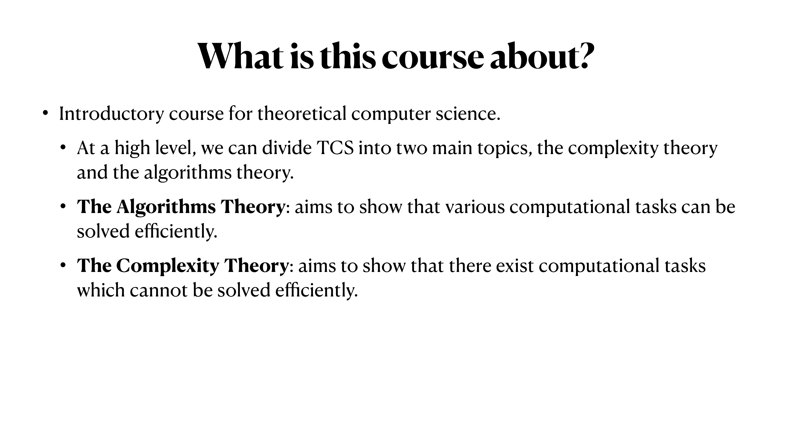
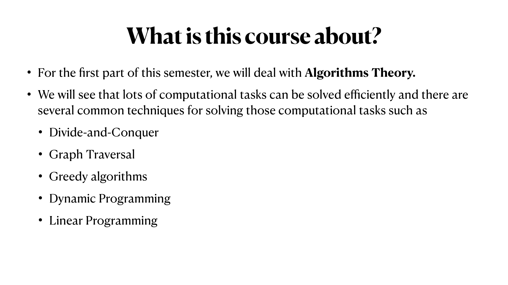
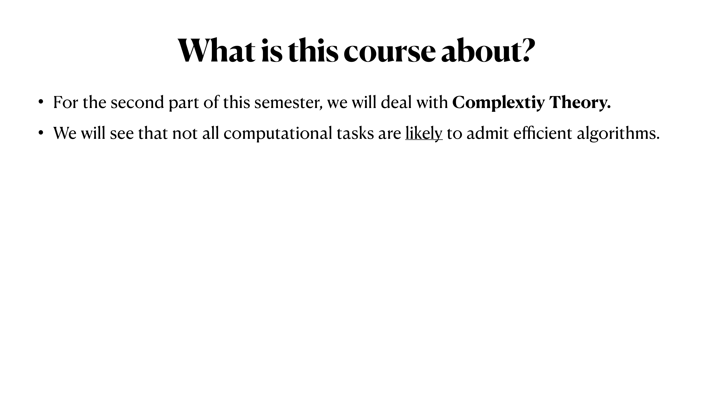

# Presentation Analysis

## Slide 1



## page_000.png

### 슬라이드 주제
이 슬라이드는 이론적 컴퓨터 과학(Theoretical Computer Science)에서 다루는 주요 주제들을 개괄적으로 소개하는 내용을 담고 있다.

### 그림 / 도표 설명
해당 슬라이드에는 도표나 그림이 포함되어 있지 않고, 순수한 텍스트로 구성되어 있다. 주요 내용은 이론적 컴퓨터 과학의 두 가지 핵심 영역인 알고리즘 이론(Algorithms Theory)과 복잡도 이론(Complexity Theory)에 대한 설명이다.

### 전공 관점에서의 매우 자세한 설명
이 슬라이드는 이론적 컴퓨터 과학에 대한 개요와 이를 구성하는 두 가지 주요 이론적 틀에 대한 정보를 제공한다.

1. **알고리즘 이론 (Algorithms Theory)**:
    - 이 영역은 다양한 계산 작업들이 효율적으로 해결될 수 있음을 증명하는 데 주력한다. 이론적 컴퓨터 과학에서 알고리즘은 특정 문제를 해결하기 위한 단계적 절차를 제공하며, 이러한 알고리즘의 효율성을 입증하는 것이 중요하다. 효율성은 일반적으로 복잡도 분석을 통해 평가되며, 시간 복잡도와 공간 복잡도가 주요 요소이다.

2. **복잡도 이론 (Complexity Theory)**:
    - 반대로, 복잡도 이론은 효율적으로 해결할 수 없는 계산 작업들이 존재함을 보여주는 것을 목표로 한다. 이 이론은 문제들이 얼마나 어려운지를 분류하며, 해결 불가능이 아닌 효율적으로 해결할 수 없는 문제들을 식별하는 데 중점을 둔다. P 클래스와 NP 클래스와 같은 복잡도 클래스가 대표적이며, 이 이론은 특히 P-NP 문제와 같은 중요한 개념들을 포함한다.

이 두 분야는 이론적 컴퓨터 과학의 기반을 형성하며, 다양한 계산 문제를 분석하고 해결하는 데 필요한 원리를 제공한다. 또한, 컴퓨터 과학 내 다른 영역들 역시 이러한 이론적 틀을 기반으로 발전하고 있다.

---

## Slide 2



## page_001.png

### 슬라이드 주제

이 슬라이드는 이 수업의 개요에 대해 설명하고 있으며, 특히 "알고리즘 이론(Algorithms Theory)"을 중점적으로 다루고 있음을 나타냅니다. 학기 초반부에 학습할 내용을 정리한 것입니다.

### 그림/도표 설명

슬라이드에는 주요 알고리즘 기법들이 나열되어 있으며, 나열된 기법들은 다음과 같습니다:

- Divide-and-Conquer (분할 정복)
- Graph Traversal (그래프 탐색)
- Greedy Algorithms (탐욕 알고리즘)
- Dynamic Programming (동적 프로그래밍)
- Linear Programming (선형 프로그래밍)

### 전공 관점에서의 매우 자세한 설명

알고리즘 이론은 컴퓨터 과학의 중요한 연구 분야로, 다양한 문제를 효율적으로 해결할 수 있는 방법을 연구합니다. 

1. **Divide-and-Conquer (분할 정복)**: 문제를 더 작은 부분 문제로 나누고 각각을 독립적으로 해결한 후, 해결된 부분 문제들을 합치는 방식입니다. 예로는 퀵 정렬(Quick Sort)과 병합 정렬(Merge Sort)이 있습니다.

2. **Graph Traversal (그래프 탐색)**: 그래프 자료구조에서의 탐색을 의미하며, 깊이 우선 탐색(DFS)과 너비 우선 탐색(BFS)이 대표적입니다. 그래프 탐색은 네트워크 구조를 이해하는 데 필수적이며, 최단 경로 문제 등의 다양한 응용이 있습니다.

3. **Greedy Algorithms (탐욕 알고리즘)**: 현재 상황에서 가장 좋은 선택을 하는 방법입니다. 각 단계에서 최선의 선택을 하여 문제를 해결하는 기법이며, 대표적인 예로는 다익스트라 알고리즘과 크루스칼 알고리즘이 있습니다.

4. **Dynamic Programming (동적 프로그래밍)**: 복잡한 문제를 해결하기 위해 문제를 더 작은 하위 문제로 나누고, 하위 문제의 결과를 재사용하여 전체 문제를 해결하는 방식입니다. 피보나치 수열이나 최적화 문제 해결에 널리 사용됩니다.

5. **Linear Programming (선형 프로그래밍)**: 선형 관계로 모델링된 문제를 최적화하는 방법론으로, 제약 조건 하에서 목표 함수를 최적화하는 문제를 다룹니다. 산업 공정 최적화나 자원 할당 문제에 흔히 사용됩니다.

이 수업은 이러한 기법들을 깊이 있게 탐구하고, 이론적인 이해뿐 아니라 실질적인 문제 해결 능력을 기르는 것을 목표로 하고 있습니다.

---

## Slide 3


## page_002.png

### 슬라이드 주제
이 슬라이드는 "What is this course about?"라는 제목으로, 강의의 주요 주제에 대해 설명하고 있습니다.

### 그림 / 도표 설명
해당 슬라이드에는 기본적인 텍스트만 포함되어 있으며, 그림이나 도표는 없습니다. 주요 내용은 강의의 초점을 설명하는 두 가지 요점으로 구성되어 있습니다.

### 전공 관점에서의 매우 자세한 설명
이 강의는 알고리즘 이론(Algorithms Theory)을 다루며, 특히 알고리즘 분석에 중점을 둡니다. 알고리즘 분석은 두 가지 주요 측면에서 이루어집니다:

1. **Correctness Analysis (정확성 분석)**
   - 알고리즘이 주어진 문제를 정확히 해결하는지를 확인합니다. 이는 알고리즘이 논리적으로 올바르게 설계되었는지, 모든 가능한 입력에 대해 기대하는 출력을 생성하는지를 이해하는 과정입니다.
   - 정확성 분석은 알고리즘이 모든 경로와 조건에서 의도한 대로 작동하는지를 수학적으로 증명하는 것을 포함할 수 있습니다.

2. **Time Complexity Analysis (시간 복잡도 분석)**
   - 알고리즘의 효율성을 평가하는 측면으로, 알고리즘이 실행되기까지 필요한 시간을 평가합니다.
   - 시간 복잡도는 주로 빅 오 표기법(Big O Notation)을 사용하여 분석되며, 이는 최악의 경우 시나리오에서 알고리즘이 얼마나 오래 걸릴지를 나타냅니다.
   - 시간 복잡도는 알고리즘의 성능을 개선하기 위한 중요한 기초 자료가 됩니다. 예를 들어, 입력 크기가 커질수록 실행 시간이 어떻게 증가하는지를 예측할 수 있습니다.

이와 같은 분석 방법을 통해 학생들은 알고리즘을 설계하고 평가하는 데 필요한 기초적인 이론과 실용적인 기술을 습득할 수 있습니다.

---

## Slide 4



```markdown
## page_003.png

### 슬라이드 주제
이번 슬라이드는 강의의 중요한 부분인 '복잡도 이론(Complexity Theory)'에 대해 소개하고 있습니다. 

### 그림 / 도표 설명
슬라이드에는 주제 문구 "What is this course about?"가 크게 작성되어 있으며, 그 아래에 두 개의 주요 bullet point가 나열되어 있습니다. 첫 번째 항목은 이번 학기의 후반부에서 '복잡도 이론'을 다룬다는 내용입니다. 두 번째 항목은 모든 계산 과제가 효율적인 알고리즘으로 해결되는 것은 아님을 설명합니다.

### 전공 관점에서의 매우 자세한 설명
복잡도 이론은 알고리즘 연구의 한 분야로, 문제의 난이도와 이에 소요되는 계산 자원의 한계를 다룹니다. 이는 컴퓨터 과학에서 매우 중요한 주제로, 각 계산 문제의 시간 복잡도 및 공간 복잡도를 평가하고 어떤 문제들이 다항 시간(polynomial time) 내에 해결될 수 있는지 분석합니다. 이 슬라이드에서는 특정 문제들이 효율적인 알고리즘으로 해결되지 않을 수 있음을 강조하여, P와 NP 문제의 구분과 같은 심도 있는 이론적 배경을 탐구할 것임을 예고합니다. 복잡도 이론은 컴퓨터 시스템의 성능 최적화, 문제 해결 전략 개발, 그리고 이론적 컴퓨터 과학의 기반을 확장하는 데 기여합니다.
```

---

